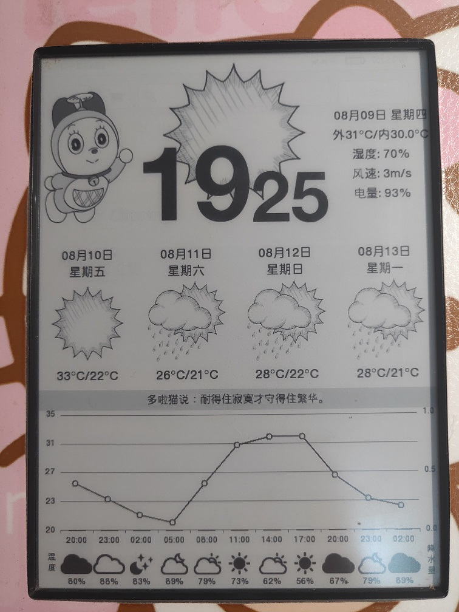

# kindle-weather-clock
a toy weather clock running on jailbreak kindle / gift for my girlfriend.

Tested on Kindle Touch 4. 



## STEP1: Jailbreak

https://wiki.mobileread.com/wiki/Kindle_Touch_Hacking 

## STEP2: Install eTcl

eTcl is required and can be downloaded from http://www.evolane.com/download/etcl/linux/etcl-1.0.1-linux-arm.tar.gz 

or HERE: https://www.mobileread.com/forums/attachment.php?attachmentid=100256&d=1359425990

## STEP3: Install clock

clone this repo & copy to /extensions/
maybe you need libz.so.1.2.8 installed in this dir

### change city id

replace id with your city id.

```java

proc ::weather::refresh {} {
	global w_current
	global w_5day3hour
	global w_16days
	set url_days "http://api.openweathermap.org/data/2.5/forecast?id=USE-YOUR-CITY"
	set url_now "http://api.openweathermap.org/data/2.5/weather?id=USE-YOUR-CITY"
	set url_ndays "http://api.openweathermap.org/data/2.5/forecast/daily?id=USE-YOUR-CITY"
```

## Using

- connect WIFI
- click Menu on Home page & choose Launcher
- select "Love Clock"
- press home button to exit

## Troubleshooting

force reboot kindle...
